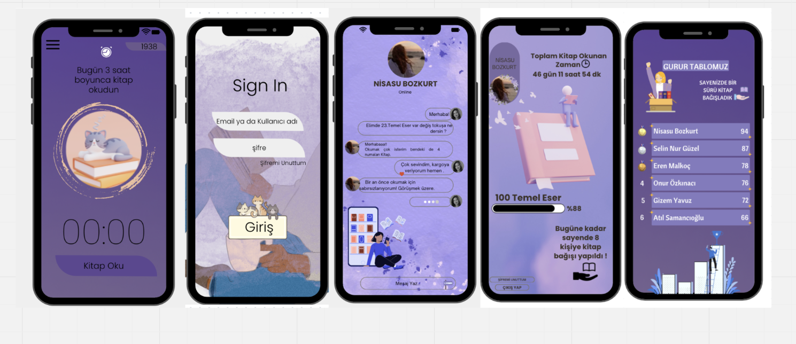
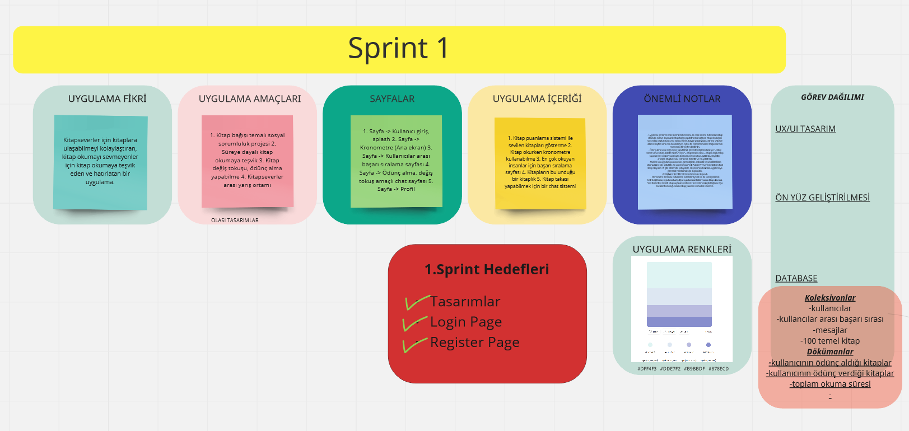

# Takım İsmi

Takım F-40

## Takım Elemanları

- Eren Malkoç: Scrum Master / Developer
- Nisasu Bozkurt: Product Owner / Developer
- Onur Özkınacı: Developer
- Selin Nur Güzel: Developer
- Gizem Yavuz: Developer

## Ürün İsmi:
ReadMe!

## Ürün İle İlgili Bilgiler

- 1. Kitap puanlama sistemi ile sevilen kitapları sıralama.
- 2. Kitap okurken odaklanma süresini artırmak için kronometre kullanımı.
- 3. En çok okuyan insanlar için başarı sıralama sayfası.
- 4. Kitapların bulunduğu bir kitaplık.
- 5. Kitap takası yapabilmek için bir chat sistemi.

## Ürün Açıklaması:

- “ReadMe!” uygulaması, kitapseverlerin ilgisini çeken kitaplara kolaylıkla erişebilmesini, kitap okuma alışkanlığı
  olmayan teşvik etmeyi ve bu doğrultuda kitap okumayı devamlı hale getirecek şekilde hatırlatmalar sunmayı
  hedeflemektedir. İçerisinde bulundurduğu zamanlayıcı, okuyucu sıralaması ve iletişim opsiyonu sunan fonksiyonlar
  sayesinde kullanıcıların uygulama içerisinde aktif bir şekilde rol almasını sağlayarak kitap okumayı daha keyifli ve
  verimli bir hâle getirmeyi amaçlamaktadır. Kullanıcıların istediği ve yeni keşfedecekleri kitaplara etkili bir şekilde
  erişimini sağlamanın yanında, belirli ölçütler çerçevesinde bağış yapılmasını da temel hedeflerden birisi haline
  getirerek sosyal sorumluluk açısından da önem arz etmektedir.

- Uygulama içerisinde coin sistemi bulunmakta. Bu coin sistemi kullanıcının kitap okuduğu süreye dayanarak kitap bağışı
  yapabilmesini sağlıyor. Kitap okuduğun süre, kitap değiş tokuşu veya ödünç verme, başarı sıralamasında bir üst
  seviyeye atlama olayları sana coin kazandırıyor. Ayrıca bu coinlerle maskot mağazasından maskotuna bir şeyler
  alabilirsin.
- Ödünç alma veya değiş tokuş yapabilmek için belirlediğin kullanıcıya “… kitap sende varsa ödünç alabilir miyim?”
  veya “… kitap sende varsa … kitapla değiş tokuş yapmak ister misin?” sorularıyla chatbot üzerinden konuşabilirsin.
  Böylelikle aradığın kitapları para vermeden bulabilir ve okuyabilirsin. - Maskot sen uygulamaya uzun süre girmediğinde
  acıkabilir veya birlikte kitap okumadığınız için sıkılabilir. Bu yüzden sana “Çok Acıktım!” Veya “Çok sıkıldım hadi
  kitap okuyalım :3” gibi bildirimler yollayabilir. Bu sistem kullanıcının uygulamaya girmesini hatırlatmak için
  düşünüldü.
- Kütüphane 100 temel eserden oluşacak.
- Kronometre kısmında kullanıcı bir süre belirleyecek ve bu süre içerisinde belirlediği birkaç uygulama hariç diğer
  uygulamaları kullanmadan kitap okumalı. Süre ilerledikçe temsili kitap sayfaları çevrilecek, süre dolmadan
  çıkıldığında veya kurallar bozulduğunda ise kitap yanacak ve maskot üzülecek.

## Hedef Kitle:

- Kitap okurken odaklanamayanlar
- Kitapseverler
- Bağışseverler
- Okumayı bilen her yaştan insanlar
- Yeni kitaplar keşfetmek isteyenler

## Juriye Not
- 

##

### Sprint 1 Çıktıları

- Sprint notları: Sprint notları [product backlog](https://miro.com/app/board/uXjVM_hL6MI=/?share_link_id=525118540066) içine eklenmiştir.
- Sprint İçinde Tamamlanması Tahmin Edilen Puan: 100 Puan.
- İş Yükü: Çıkardığımız iş listesinin toplam puanını 600 olarak belirledik. Bu sprintte ekip arkadaşlarımızın genelinin yoğunluğundan dolayı sprintin puanını düşük tutmaya karar vererek, sprinti 100 puan olarak ayarladık.
- Daily Scrum: Daily scrum toplantıları Discord üzerinden çevrimiçi görüşmeler ile yapılmıştır. Toplantı özetleri, notları ve ekran görüntülerinden bazıları product backlog içine yazılmıştır.

- User Stories.
  

- Uygulama sayfaları belirlendi, database örnek modeli oluşturuldu.
  

- Login ve Register Page oluşturuldu, çeşitli oturum açma seçenekleri eklendi.
  

- Login ve Register Page için örnek tasarımlar oluşturuldu. Uygulama renkleri belirlendi.
  

### Sprint Review
-Uygulama Firebase'e bağlandı,çeşitli servisler (authentication,firestore database) eklendi.
Uygulama tasarımı için örnekler oluşturuldu.Uygulama içerisinde kullanılacak paketler eklendi.

### Sprint Retrospective
-Proje yönetim aracı değiştirildi.

## Product Backlog URL

- [Bootcamp Team F-40 Miro Backlog Board](https://miro.com/app/board/uXjVM_hL6MI=/?share_link_id=525118540066)

### Sprint 2 Çıktıları
- Daily Scrum: Daily scrum toplantıları Discord üzerinden çevrimiçi görüşmeler ile yapılmıştır. Toplantı özetleri, notları ve ekran görüntülerinden bazıları product backlog içine yazılmıştır.
- Figma Üzerinden Sayfalarımızın Tasarımlarını tamamladık .
  
  
-İş Yükü: Bu sprintte ekip arkadaşlarımızın genelinin yoğunluğundan dolayı sprintin puanımızı 200 olarak belirledik. Miro üstündeki belgede de takım arkadaşlarımız ile iş bölümünü yaptık .

### Sprint Review
-Uygulama Firebase'e bağlandı,çeşitli servisler (authentication,firestore database) eklendi.
-Uygulama tasarımı figma üstünde tamamlandı.
-Login ve Register sayfalarının backend kısımları tamamlandı.
-Splash ekranı hayata geçirildi.
