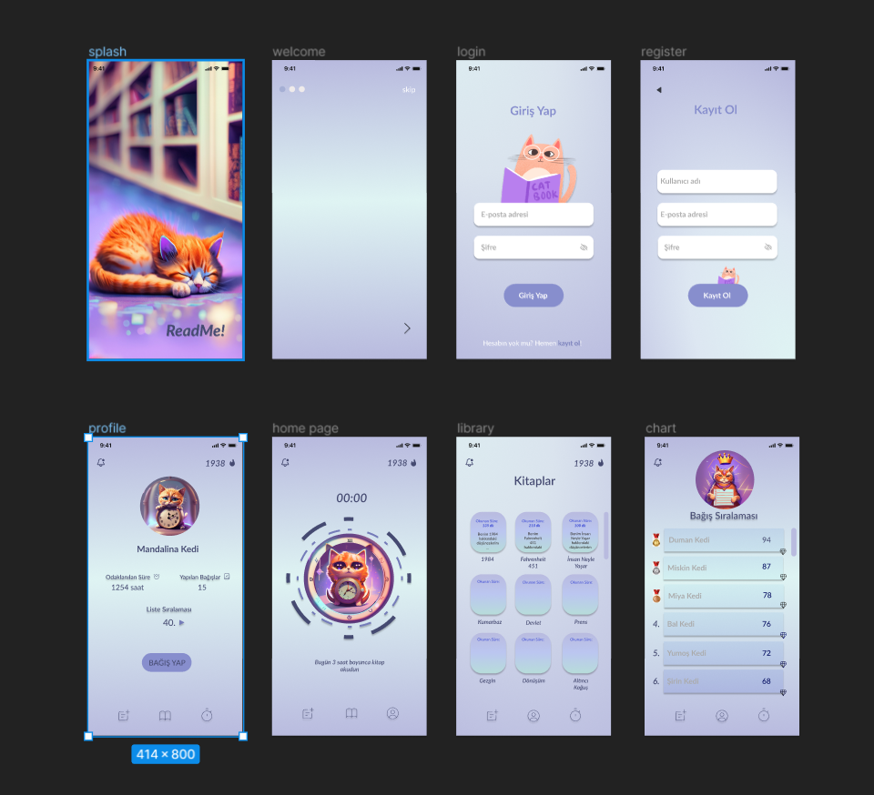
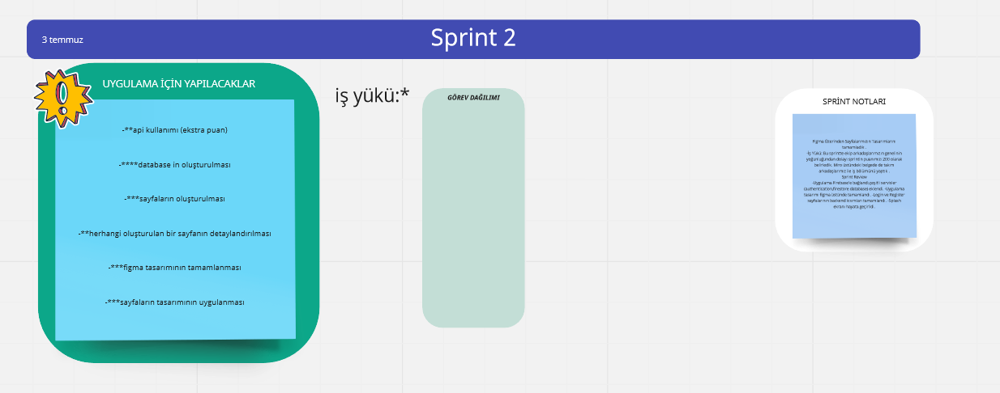
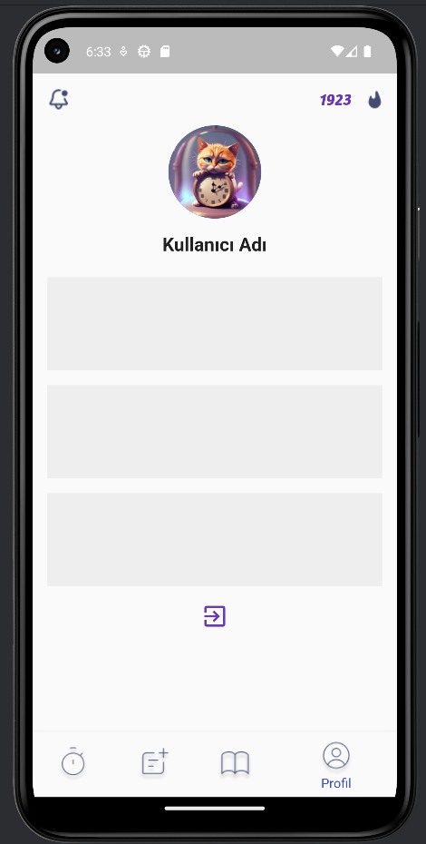
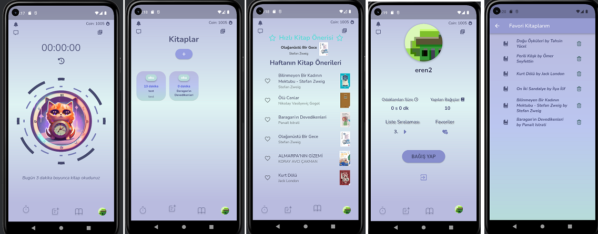
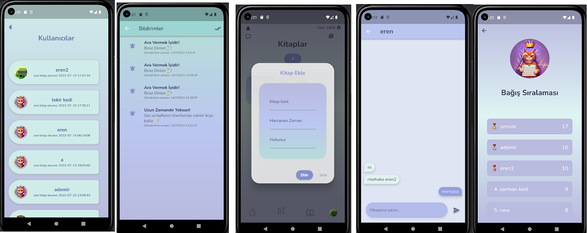

# Takım İsmi

Takım F-40

## Takım Elemanları

- Eren Malkoç: Scrum Master / Developer
- Nisasu Bozkurt: Product Owner / Developer
- Onur Özkınacı: Developer
- Selin Nur Güzel: Developer
- Aktif olmayan üye -> Gizem Yavuz

## Ürün İsmi:

ReadMe!

## Ürün İle İlgili Bilgiler

-
    1. Kronometre veya zamanlayıcı ile kitap okuma için odaklanma süresini arttırma.
-
    2. Hızlı ve haftalık kitap önerileriyle yeni kitaplar keşfetme ve kendi kütüphanene ekleme.
-
    3. En çok bağış yapan insanlar için bağış sıralama sayfası.
-
    4. Kullanıcının kitaplarının bulunduğu bir kitaplık.
-
    5. Kitaplara erişimi kolaylaştırmak için bir forum sayfası.
-
    6. Kitap değiş tokuşu veya alışverişi için mesajlaşma sayfası.
-
    7. Okudukça coin kazanma ve bu coinlerle bağış yapabilme.
-
    8. Renkli tasarımıyla çocukların da ilgisini çekecek olan bu uygulama insanları kitap okumaya teşfik edecek!

## Ürün Açıklaması:

- “ReadMe!” uygulaması, kitapseverlerin ilgisini çeken kitaplara kolaylıkla erişebilmesini, kitap okuma alışkanlığı
  olmayan teşvik etmeyi ve bu doğrultuda kitap okumayı devamlı hale getirecek şekilde hatırlatmalar sunmayı
  hedeflemektedir. İçerisinde bulundurduğu zamanlayıcı, bağış sıralaması ve iletişim opsiyonu sunan fonksiyonlar
  sayesinde kullanıcıların uygulama içerisinde aktif bir şekilde rol almasını sağlayarak kitap okumayı daha keyifli ve
  verimli bir hâle getirmeyi amaçlamaktadır.

- Kullanıcıların istediği ve yeni keşfedecekleri kitaplara etkili bir şekilde erişimini sağlamanın yanında, belirli ölçütler çerçevesinde bağış yapılmasını da temel hedeflerden birisi haline getirerek sosyal sorumluluk açısından da önem arz etmektedir.

- Uygulama içerisinde coin sistemi bulunmakta. Bu coin sistemi kullanıcının kitap okuduğu süreye dayanarak kitap bağışı
  yapabilmesini sağlıyor. 10-20 dk için 5, 20-40 dk için 30 ve her saat başı 100 coin veriyoruz. 2000 coine ulaşan kullanıcı, 'Bağış Yap' butonuna tıklarsa bizler kullanıcı adına kitaba ihtiyacı olan insanlara kitap bağışında bulunuyoruz.
  
- Günümüzde artık kitaplara ulaşmak ya çok pahalı ya da istediğimiz kitapları bulunamıyoruz. Artık Kitap Köprüsü ile kitaplar için ödünç alma, değiş tokuş veya kitap alışverişi yapabilmek için forum sayfasından aradığın kitabı bulup ilanın sahibi olan kullanıcıya mesaj atıp atıp iletişime geçerek kitaplara daha kolay ulaşılabilir.
  
- Uygulamaya uzun süre girmediğinde sana kitap okuman için hatırlatma bildirimleri yolluyoruz.
  
- Okuyacağın kitabı belirlemekte zorlanıyor musun? Hızlı ve haftalık kitap önerileriyle artık kitap seçmen çok kolay!
  
- Kronometre kısmında kullanıcı bir süre belirleyip zamanlayıcıyı çalıştırabilir veya kronometre tutabilir. Bu süre içerisinde sayfadan çıkmadan kitap okumazsa kronometre sıfırlanır ve böylece coin kazanılamaz. Bu sayede insanları odaklanmaya teşvik ediyoruz.

## Hedef Kitle:

- Kitap okurken odaklanamayanlar
- Kitapseverler
- Bağışseverler
- Okumayı bilen her yaştan insanlar
- Yeni kitaplar keşfetmek isteyenler
- Aradığı kitabı bulmakta zorluk çekenler

## Juriye Not
- 

##

### Sprint 1 Çıktıları

- Sprint notları: Sprint notları [product backlog](https://miro.com/app/board/uXjVM_hL6MI=/?share_link_id=525118540066)
  içine eklenmiştir.
- Sprint İçinde Tamamlanması Tahmin Edilen Puan: 100 Puan.
- İş Yükü: Çıkardığımız iş listesinin toplam puanını 600 olarak belirledik. Bu sprintte ekip arkadaşlarımızın genelinin
  yoğunluğundan dolayı sprintin puanını düşük tutmaya karar vererek, sprinti 100 puan olarak ayarladık.
- Daily Scrum: Daily scrum toplantıları Discord üzerinden çevrimiçi görüşmeler ile yapılmıştır. Toplantı özetleri,
  notları ve ekran görüntülerinden bazıları product backlog içine yazılmıştır.

- User Stories.
  

- Uygulama sayfaları belirlendi, database örnek modeli oluşturuldu.
  

- Login ve Register Page oluşturuldu, çeşitli oturum açma seçenekleri eklendi.
  

- Login ve Register Page için örnek tasarımlar oluşturuldu. Uygulama renkleri belirlendi.
  

### Sprint Review

- Uygulama Firebase'e bağlandı,çeşitli servisler (authentication,firestore database) eklendi.
Uygulama tasarımı için örnekler oluşturuldu.Uygulama içerisinde kullanılacak paketler eklendi.

### Sprint Retrospective

- Proje yönetim aracı değiştirildi.

## Product Backlog URL

- [Bootcamp Team F-40 Miro Backlog Board](https://miro.com/app/board/uXjVM_hL6MI=/?share_link_id=525118540066)

### Sprint 2 Çıktıları

- Sprint notları: Sprint notları [product backlog](https://miro.com/app/board/uXjVM_hL6MI=/?share_link_id=525118540066)
  içine eklenmiştir.
- Daily Scrum: Daily scrum toplantıları Discord üzerinden çevrimiçi görüşmeler ile yapılmıştır. Toplantı özetleri,
  notları ve ekran görüntülerinden bazıları product backlog içine yazılmıştır.
- Figma Üzerinden Sayfalarımızın Tasarımlarını tamamladık .
  
- Puan Tamamlama Mantığı: Toplamda proje boyunca tamamlanması gereken 300 puanlık backlog bulunmaktadır. 3 sprint'e
  bölündüğünde ilk sprint'in en azından 100 ile başlaması gerektiğine karar verildi.

- İş yükü tablo haline getirildi.
- 
  

- Profil Sayafası Oluşturuldu.
- 
  

- Kitaplar Sayfası Oluşturuldu.
- 
  
  
- Kitap Detay Sayfası Oluşturuldu.
- 
  

- 

- 

### Sprint Review

- Firebase database oluşturuldu
- Google Book API kullanıldı
- Tüm sayfaların tasarımı figmada tamamlandı.
- Login ve Register sayfalarının backend kısımları tamamlandı.
- Splash ekranı hayata geçirildi.

### Sprint Retrospective

- İş yükü dağılımı değiştirildi.
